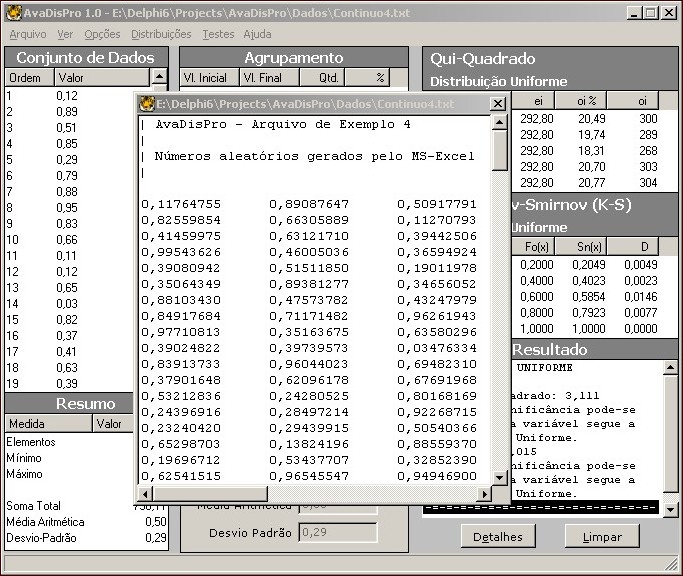
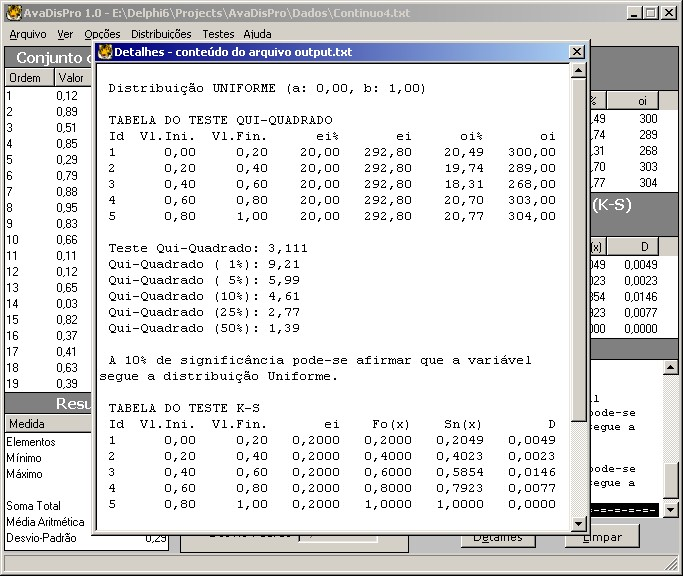

# AvaDisPro

**AvaDisPro** (Probability Distribution Selection Assistant) is the final project developed by **Claudio Kinzel** for the **Computer Science program (emphasis in Systems Analysis)** at **Unisinos (Universidade do Vale do Rio dos Sinos)**, under the guidance of **Professor Ernesto Lindstaedt**.

AvaDisPro is a support tool for selecting probability distributions. Given an initial data set, AvaDisPro reads the data, classifies it into intervals, and performs the **Kolmogorov–Smirnov (K-S)** and **Chi-Square** tests to determine whether the data follows a known probability distribution.

---

## 🔍 Features

- Developed in **Delphi** using the **CLX library** (supports cross-platform usage with GNU/Linux).
- **Free to use, copy, modify, and distribute** — for **non-commercial purposes only**.
- Supports **continuous distributions**:
  - Exponential
  - Log-Logistic
  - Gamma
  - Normal
  - Triangular
  - Uniform
  - Weibull
- Supports **discrete distributions**:
  - Binomial
  - Negative Binomial
  - Geometric
  - Poisson
  - Discrete Uniform
- Accepts both **raw and tabulated data**.
- Automatically performs **Chi-Square** and **Kolmogorov–Smirnov** tests.
- Includes a complementary module named **CP-AvaDisPro** (AvaDisPro Probability Calculator) for computing individual probabilities.

---

## 📸 Screenshots

User source data

Chi Square and KS test results

## ⬇️ Download

You can download the **Windows version**, **GNU/Linux version**, and the **source code**.

## 📜 License

This software is free for non-commercial use only.

Permission to use, copy, modify, and distribute this program for evaluation, teaching, and/or research purposes only and without fee is hereby granted, providing that this copyright and permission notice appear on all copies and supporting documentation, and that similar conditions are imposed on any individual or organization to whom the program is distributed. The author makes no representation about the suitability of this software for any purpose.

It is provided "as is" without express or implied warranty.
